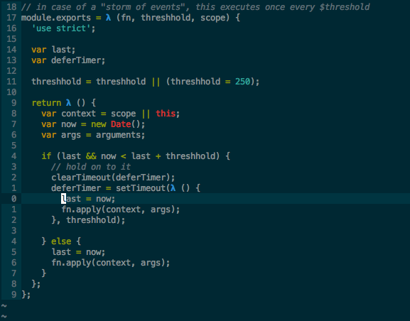

vim-lambdify
=====================

A vim plugin that conceals lambdas/inline functions with a lambda character for
various languages





Requirements
------------
Vim >= 7.3 (for the conceal feature)

Some file types rely on syntax files built-in to Vim >= 7.4

Installation
------------

If you are using  or , add this to your list of bundles::

    Plugin 'calebsmith/vim-lambdify'

For  use:

    Plug 'calebsmith/vim-lambdify'

Another option is manually copying the /after/syntax files into
~/.vim/after/syntax and /autoload/vimlambdify.vim into ~/.vim/autoload

A third option is to clone this repo and run make, which will automatically
do the work of copying the appropriate files to a location within ~/.vim

Overview
--------

Vim's conceal feature allows for some text to be replaced with something else
for display purposes, without changing the underlying representation of what
is saved into the file. Plugins such as vim-haskellConceal and vim-cute-python
use this to replace many different things with more pithy/mathy symbols. The
approach taken here is to replace *only* lambdas, but to do so for many
different languages to avoid having to use many plugins for a single feature.

Additionally, some plugins lose syntax highlighting for concealed characters.
vim-lambdify makes efforts to ensure highlighting is kept.

At the moment, the following languages have lambda conceal support through
vim-lambdify:

- Clojure
- Scheme
- Erlang
- Haskell
- Elm
- Python
- Ruby
- JavaScript
- Java
- C#

N.B.
----

The [vim-polyglot](https://github.com/sheerun/vim-polyglot) plugin is a dependency for the JavaScript arrow function (`=>`) to work properly, since the default syntax file is outdated.

For Java it's necessary to change this line in the default Java syntax file (`$VIMRUNTIME\syntax\java.vim`):

```vim
syn match javaError "<<<\|\.\.\|=>\|||=\|&&=\|[^-]->\|\*\/"
```

to:

```vim
syn match javaError "<<<\|\.\.\|=>\|||=\|&&=\|\*\/"
```
Otherwise the `->` operator will be highlighted as error by default. You can use the  plugin, that already has this correction.

More will likely be added over time. These just happen to be languages I use
frequently that have lambdas or something akin to them.

Feel free to open a pull request to incorporate an unsupported language.

Acknowledgements
----------------
Many thanks for the ideas and some implementation details taken from the
following plugins:

- Twinside/vim-haskellConceal
- ehamberg/vim-cute-python
- dkinzer/vim-schemer
- tyok/js-mask
